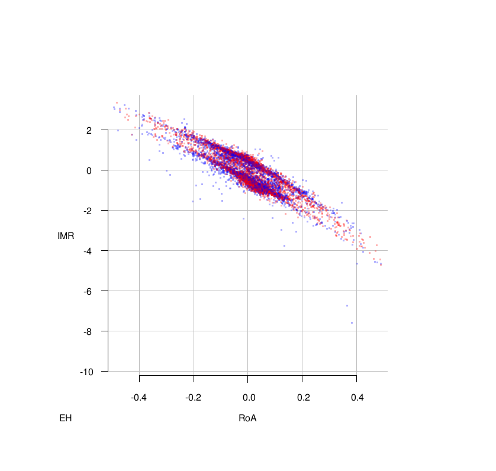
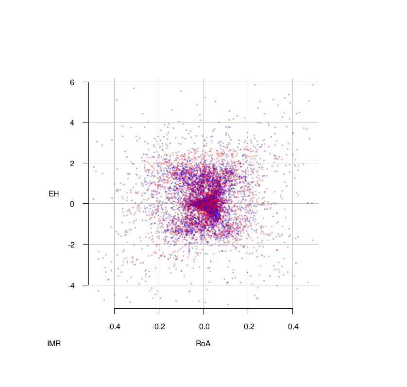

# Introduction

In planning an experiment in basic or clinical research,
power analysis is important for determining feasibility and
budgeting for a sample size sufficient to avoid an indeterminate
result. Conversely, accurate power analysis also helps contain
costs by avoiding excessive sample sizes. Power analysis
depends on a probability density function over all possible
outcomes for an experiment given a particular set of
parameters. Real-world processes, especially in the life sciences, often have density functions that either lack a
closed-form solution or are complex to implement.
Furthermore, it is not always clear how large of a sample size is sufficient to meet the asysmptotic assumptions of one's statistical tests. A promising approach is to generate simulated data spanning the relevant parameter-space.

This allows the researcher to realisticall budget for follow-up intervals, participant recruitment targets, and choice of analysis method prior to initiating an experiment or clincal trial.

Existing Monte Carlo methods to characterizing distributions [@fang08; @schoemann14] depend on hardcoded assumptions about the type of
phenomenon being studied and the statistical model being
fitted to the data. We have developed and are continuing to improve an open
source library for the R statistical language that implements a simpulation and test framework that can be adapted to various populations, study designs, and outcomes being measured. Instead of interpreting treatement effect as a simplistic uni-directional difference our approach is to accrue data by repeatedly running statistical workflows and decision rules representative of what the researcher is considering for their actual experiment. These virtual experiments are imlemented as modules with a automated code-generation function that makes it easier to create new ones or adjust existing ones to the needs of a given project.

# Background

In mammals, the risk of mortality is not constant over time. Rather, it increases log-linearly with age [@MuellerGompertzequationpredictive1995; FinchSlowmortalityrate1990]. Using only ages of death or at loss-to-followup (censored events), the Gompertz probability density function can be used to obtain the maximum likelihood estimates for the initial risk of mortality (IMR or $\lambda$ ) and the rate at which it accelertates (RoA or $\gamma$ ). On a log scale these correspond to a slope and an intercept of mortality risk over time. These parameters can then be plugged back into the observed data to its likelihood. When comparing a test group with a control group the null hypothesis is that their lifespans are no different from each other and therefore the same pair of IMR and RoA parameters are sufficient to fit the observed data. However, if the two groups have different IMRs, a model with three parameters-- IMR$_{control}$, IMR$_{treated}$, and RoA -- will have a larger likelihood and this is the basis of the likelihood ratio test as used here. The same principle applies a difference in the RoAs between the groups, or differences in both parameters (now the likelihood from the two-parameter null model is being comparted to the likelihood from a four-parameter model where everything is different between the two groups, adjusted for the additional difference in degrees of freedom).

We recently reported that the Weibull and the Cox Proportional Hazard tests had roughly similar performance to a likelihood ratio test using estimates of Gompertz model parameters obtained via Nelder-Mead optimization [@NelderSimplexMethodFunctionMinimization1965]. The Weibull model was found to be slighly less sensitive and slightly more resistant against false positives than the others [@bokov2017riskmodels]. However, when the IMR increased (i.e. higher initial hazard) and RoA decreased (i.e. hazard increases more slowly) in a test group compared to the control group, or vice versa, only the Gompertz likelihood ratio test could detect differences even though the survival curves visibly diverged. Our simulations were based on hazard estimates for laboratory mice.

But we cannot assume that these conclusions are automatically applicable to humans. Clearly humans are orders of magnitude longer-lived so human IMR and RoA parameters will be smaller and harder to detect. Furthermore, laboratory animals are kept in as homogeneous an environment as possible, while humans are in some sense a 'wild' population so in addition to IMR and RoA, a third parameter may need to be included to account for extrinsic hazards-- EH, or *c* . This extended model is called Gompertz-Makeham and was used here.

# Methods

## Data

In our earlier work we used combined results for just the control groups of multiple longevity studies carried out using non-mutant C57Bl6 mice to obtain parameters with which to generate simulated data representative of this species. For humans we used life-tables for the combined US population from 2013 [@arias_united_2017b]. These are the second to most recent available, and we are deliberately holding out the 2014 installment published this year [@arias_united_2017b] as a validation dataset for upcoming work. 

The life table data is in one-year increments for 99,316 individuals with all deaths over 100 years binned together. We extracted these data out into individual time-points and smoothed out the bins to monthly bins rather than yearly, with all deaths above 100 years given a censoring indicator. In Figure 1 we present the raw data and the smoothed data on the same scale, along with a simulated survival curve generated using the parameters estimated from this data (IMR = 3.024956e-06, RoA = 7.669709e-03, and EH = 1.970425e-05). It can be seen from the figure that smoothing the time intervals to months (necessary to avoid numeric artifacts caused by too many tied events) does not significantly bias the data. It also shows how closely the simulated distribution of deaths resembles the real data, though the only information from the data that was used by the simlation were the three hazard parameters.

{ width=50% }

In our rodent results [@bokov2017riskmodels] we found that below a sample size of 60, there was an increasing bias in the estimates of both the IMR and RoA parameters. In order to find the corresponding threshold for humans we used the above parameter estimates to create 100,000 simulations of this cohort, varying the sample size between 100 and 500. For each sample we estimated the three Gompertz-Makeham parameters and compared to the known values used by the simulation in order to assess how variability and estimation bias changes with sample size. We found the threshold for a human population binned into 1-month intervals to be 200. (Figure 2.)

{ width=60% }

## Software

Our simulation framework for power analysis and exploration of distributional properties of data is called PowerTrip ( https://github.com/bokov/powertrip/tree/test_polar ). It is implemented as a package for the R statistical language [@Rlanguage; @survival-package; @survival-book] and has the following other packages as its essential dependencies: eha [@eha], MASS [@MASS], SparseM [@SparseM], and broom [@broom]. Some of the figures in this manuscript were prepared using the plot3D [@plot3D] and rgl [@rgl] packages. 

At initialization, the user sets upper and lower bounds on all model parameters, and the reference parameters that will be used to simulate the control group for every comparison. The parameter-space is centered on the reference point and treatment effects are modeled as deviations from it. Here, the parameter deviations the three hazards: IMR, RoA, and EH. An increase in any of them would result in a shorter survival time relative to the control group, *ceteris paribus*. Likewise a decrease would be associated with a longer survival-time. One of the distinguishing features of our approach is that instead of making assumptions about the direction of change due to an experimental intervantion, we probe every possible direction and continuously update our estimate of the multi-dimensional surface that represents the combinations of paramter differences that are jointly large enough to be detectable by the proposed statistical method/s (or more generally, decision algorithm/s) at the specified detection rate (here we picked the 80% resolving power typical in the life sciences).

The bounded parameter space (on the log scale) is uniformly sampled. Here we used 150 points each round. The Cartesian coordinates are converted to polar coordinates and the radial coordinate *r* is ignored. At each of set of angles $\phi_{i1,\dots,in}$, random radial distances are sampled from a *B(1.333,1)* distribution (which we empirically found to mitigate some of the bias toward sampling too close to the origin). Each of these values of *r* along the angle $\phi_{i1,\dots,in}$ is converted back to relative Cartesian coordinates and passed to a module that interprets them (in our case) as IMR, RoA, and EH. This module simulates a dataset representing a control group and a treatment group with those differences from the control group's hazards. This dataset is passed to a panel of decision modules, each of which evaluates the same dataset and returns a TRUE/FALSE response which in our case indicates whether or not the statistical test wrapped by this module rejected the null hypothesis of no difference between the two groups. 

*There are no hardcoded assumptions about the module that simulates the data, nor the modules that analyze it and return decisions.* In fact, we have a function (`new.ptpnl()`) that accepts code snippets from the researcher to specify the analysis method, the decision rule, and a logging/summary function. It then dynamically generates an analysis module that correctly hooks these pieces into `powertrip()`. We also extended native R's `update()` mechanism to provide a simpler alternative to make minor changes to existing analysis modules. As a proof of concept, alongside the survival analysis we are reporting here, we wrote a simulator module that generates multivariate regression datasets with interaction terms and an accompanying panel of two linear model wrappers-- one that includes interaction terms and one that attempts to detect inter-group differences using only additive terms. The boundaries of their respective 80% detection regions are shown in figure 3.

{ width=50% }

Powertrip is designed to allow multiple 'competing' analysis modules to evaluate the same simulated dataset allowing for the fairest possible comparison of sensitivity, precision, bias, and any other aspect of performance that is of interest to the researcher. After all analysis modules have evaluated the dataset simulated at each point along $\phi_{i1,\dots,in}$, a univariate logistic regression model is fitted for each analytic module, where the vector of TRUE/FALSE responses from the model is the outcome variable and the corresponding *r* is the predictor (since the $\phi_{i1,\dots,in}$ is held constant). The `dose.p()` function from the MASS package [@MASS] is used to reverse-predict the value of *r* that would result in an 80% detection rate (i.e. a power of 0.8). A new set of *r* s is sampled from a smaller range based on the confidence intervals of the reverse prediction. This is the innermost loop of the process implemented by the `phi_radius()` function. It continues the cycle of simulation, analysis, and prediction continues until every analysis module in the panel either has a confidence interval within the user-specified number of standard deviations or has undergone convergence failure. For the non-failing modules their respective final predictions $r_{im final}$ are recorded as the estimates closest to the 80% detection rate at $\phi_{i1,\dots,in}$. Then, `powertrip()` invokes `phi_radius()` for the next set of angles, $\phi_{(i+1)1,\dots,(i+1)n}$. After this middle loop iterates over all the $\phi$ s, the outer loop (also in `powertrip()`) generates the next set of random Cartesian coordinates. But, on all iterations after the first, at this point a *second* set of predictions is done, this time with the $\phi$ s as the predictors and the *r* s as the outcomes. Prediction confidence intervals are harvested for each of the newly generated $\phi$ s. Where they are narrower than the the overall user-defined boundaries of the parameter-space, they are used in their stead, to further speed up convergence.

## Statistics

We used the Weibull ( `survreg(Surv(tt)~group)` ) and Cox proportional hazard ( `coxph(Surv(tt)~group)` ) models, each in a side-by-side comparison with a likelihood ratio test comparing the fit of a three-parameter Gompertz-Makeham model (i.e. one set of IMR, RoA, and ER hazards shared between the control and treatment groups ) to a six-parameter one (i.e. potentially each of the hazards is different). The significance threshold was set at p<0.05.

## Other design features of interest

R normally passes variables by value, not by reference although in recent versions lazy evaluation has made this less of a performance issue. Nevertheless, when this much data is being moved around, it is desirable to avoid copying entire data structures. Instead, an special type of object that in R is called an `environment` is passed around. It is a pointer to a container of arbitrarily large data structures and most of the important accessor and mutator methods for `lists` (R's workhorse data structure) also exist for `environment` s. Results from the inner loop are logged to an environment object and when functions in the outer loops need to access those results they can do so without them being explicitly passed to them. Upon completion of the run, the environment is saved to an `.rdata` file and we have a function called `read_ptenv()` that can turn it into a custom object that has its own `[` (subset), `print()` and `summary()` methods that allow the researcher to cleanly and concisely retrieve from it various combinations of variables in tabular form for analysis, reporting, and visualization. Since state information is also stored in this environemt object, we can restart a previously interrupted run of `powertrip()`, or we can have one instance of `powertrip()` complete its burn-in cycle and then launch multiple instances from its save-file. The more collected data a `powertrip()` instance has access to, the better its prediction intervals will presumably be, prompt synchronization of results is not required. Therefore in principle it is possible for multiple nodes to constantly improve each other's performance by exporting and merging results on a best-effort basis.

The other feature which seems to be lacking in the R packages we are aware of are runtime hooks for debugging, saving, and even patching. `phi_radius()` checks its directory for the existance of files having a user-configurable name. The `savetrigger` file causes it to immediately save the logging environment to a file, after which the file is removed. The `debugtrigger` file drops PowerTrip into an R debugger without terminating it and after the debug session is finished it can continue on as normal. Finally, if the `sourcepatch` file is detected it is executed as an R script within the local scope and then renamed. Prudent use of these features reduce time wasted relaunching a lengthy process just to fix a minor configuration error or losing data because the process has not completed before a system shutdown. In point of fact, even though there are convergence criteria for individual points, we don't consider the overall simulation to ever be complete-- we intend for them to run continuously and generating ever more precise estimates.

# Results

## Is the Makeham parameter detectable and practically relevant?

We have found the same inverse relationship between RoA and IMR as in the mouse data [@bokov2017riskmodels]. However with these data there was hardly any separation between the Gompertz-Makeham model and the Weibull model in figures 4-6 below. The same pattern was observed for the Cox proportional hazard model (not shown).

{ width=100% }

There is no linear relationshp between EH and either of the other prameters, i.e. perturbing the EH does not globally increase or decrease the ability to detect differences in the other parameters. The visual patterns in figures 5 and 6 may be illusory, due to points still being sampled more often near the center.

{ width=100% }

{ width=100% }

# Future work

## Targeting informative spaces

For predictions, there is much room for imporvement beyond just better targeting of sampling ranges for radii. It should be possible to predict the detection rates for the points that are sampled on the Cartesian space in the outer loop, and target the ones that are closest to the target distance and yet have the largest prediction confidence intervals because they will be the most informative and impactful. This will likely involve Kriging or inverse weighted distance interpolation and that, in turn, requires retaining not only summaries and final estimates for each $\phi_{i1,\dots,in}$ but each of the indvidual points. With improved hardware and the use of performancre optimized `data.table` objects in R this is a likely next step.

With a good way of predicting individual points, it will become possible for researchers to benefit from the existence of PowerTrip without necessarily themselves having to run an instance: the fitted model objects can be exported from an instance and used as a static prediction engine. The role of PowerTrip then becomes that of a model factory that continues to generate and distribute updated and more accurate model objects.

## Modeling attrition and recruitment

Though long-term survival studies are important, they are not representative of the most common use cases in design of human trials. A more realistic model would be one where subjects who survive to a particular age-range are randomly enrolled into a cohort, some of them are randomly lost to follow-up, and the entire expriment ends after two or three years. Notwithstanding the fact that our implementations of these models do support right-side censoring, we have no idea what distributional properties will be of Gompertz or Gompertz-Makeham variables filtered through this additional selection/attrition process, and whether a tractable closed-form probability density function exists. But we will be able to directly perturb simulated populations that we have demonstrated are highly similar to real ones and product conditions more representative of clinical trials.

## Censoring and sample size as part of the parameter space

Since our earlier publication [@bokov2017riskmodels] we have generalized our software to support an arbitrary number of model parameters. There is no particular reason that sample size and censoring rate cannot be added as fourth an fifth dimensions. For sample size in particular, this would mean that instead of separate runs for finding the "detection surface" for a few sample sizes and trying to guess about what happens inbetween, we would be able to run a 4- or 5-dimensional PowerTrip that is learning a little bit about every sample size all the time, and borrowing information from one to make predictions about others, just as in effect here we are borrowing information about the different parameters within the model to accelerate convergence.

# Acknowledgments {-}

This work was supported by NIH grants 1P30AG044271-01, 5T32AG021890, 2P30AG013319, and RC2AG036613.

